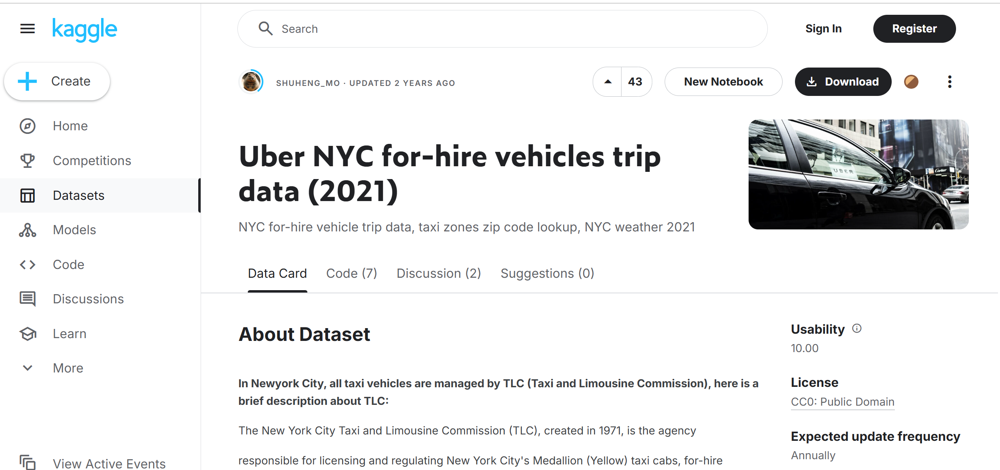

This project analyzes the Uber NYC For-Hire Vehicles trip data for the year 2021, using various data analysis and visualization techniques to derive insights that can aid business decision-making. The dataset includes information about trip characteristics such as pickup/dropoff locations, trip times, distances, fares, and tips.

## Project Overview

The primary objective of this analysis is to identify key patterns and trends in the data, such as:
- Peak usage times
- Popular pickup and dropoff locations
- Trip duration patterns
- Driver earnings
- Tips analysis based on trip distance and fare ranges

The results are visualized using various plots, such as histograms, pie charts, and line plots, to effectively communicate the findings.

## Dataset

The dataset used in this project consists of Uber NYC For-Hire Vehicles trip data for 2021. The dataset includes the following key columns:
- *Pickup and Dropoff Locations (PULocationID, DOLocationID)*
- *Trip Distance (trip_miles)*
- *Trip Duration (trip_time)*
- *Fares and Tips (base_passenger_fare, tips)*
- *Congestion Surcharge Flag (congestion_surcharge)*

The data is stored in Parquet files, which are loaded and processed using PySpark.

Dataset source: [Uber NYC For-Hire Vehicles Trip Data 2021 - Kaggle](https://www.kaggle.com/datasets/shuhengmo/uber-nyc-forhire-vehicles-trip-data-2021)


--- 
### Google Cloud Storage:


## Installation

To run this project on your local machine, follow these steps:

1. *Clone the Repository*:

   ```bash
   git clone https://github.com/Manognarayasam/nyc-for-hire-vehicles-analysis

## Project Workflow
The workflow consists of the following main steps:

1. Data Loading: Loading the dataset from Google Cloud Storage (GCS) using PySpark.

2. Data Cleaning: Handling missing data, calculating trip durations, and other preprocessing tasks.

3. Exploratory Data Analysis (EDA):
    - Identifying peak usage times (by hour and day of the week).
    - Analyzing top pickup and dropoff locations.
    - Analyzing trip durations by month.
    - Exploring driver earnings and tips patterns.
4. Data Visualization:
    - Creating various visualizations such as histograms, pie charts, line plots, and box plots to understand key patterns.
Data Saving: Saving the cleaned data back to GCS for future use or further analysis.

## Key Insights
- Peak Usage Times: Identified peak hours and days of the week for Uber trips in NYC.
- Top Pickup Locations: Highlighted the busiest areas for trip pickups.
- Trip Duration Patterns: Analyzed how trip durations vary by month and other factors.
- Driver Earnings & Tips: Investigated the relationship between trip distance, fare, and driver tips.


## Conclusion
This analysis provides valuable insights into the trip patterns and business dynamics of Uber's for-hire vehicles in NYC. By understanding peak times, popular locations, and earnings trends, Uber and similar services can make data-driven decisions to improve service efficiency and customer experience.

## Future Work

Time Series Analysis: Explore trends over time, considering seasonality and holidays.
Predictive Modeling: Develop models to predict trip demand or estimate driver earnings.
Geospatial Analysis: Use geospatial tools to better understand trip patterns by location.

## Acknowledgements
The dataset used in this project is provided by Kaggle.
Thanks to the Python and PySpark communities for their valuable tools and libraries.
